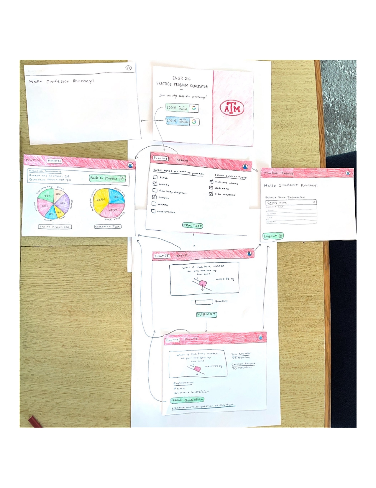

## **Customer Meeting**
**Date:** January 9, 2025, 23:00 SGT  
**Location:** Zoom  

### **Initial Questions and Concerns**
1. More clarification on the “opt-in” section for students to show scores to the instructor.  
2. Should instructors be able to write their own questions/formats?  
3. Do we want to implement a leaderboard?  
4. What does a professor want to see when they log in?

---

### **Meeting Notes**
- **“Opt in” Section**  
  - Students can choose to select their professor and choose whether they want to allow their professor to see their statistics.  
  - All professors can see the overall performance of students without names attached.

- **Professors Writing Their Own Questions/Formats**  
  - This functionality should be implemented, but all students should get the same questions.  
  - If a professor uploads a question, students in every section can see it.  
  - Write all questions initially.

- **Leaderboard**  
  - Extra features are optional and up to the team; implementing a leaderboard is encouraged.

- **Professor View/Functionalities**  
  - Check student grades.  
  - Check how many students got which questions right.  
  - Provide a detailed summary of each topic.  
  - Provide a detailed summary of each student.  
  - FERPA compliance is not mandatory.  
  - Professors should be able to see all students, even those who have not selected them as a professor.  
  - Provide percentage statistics, including:
    - Percent of students who attempted a unit.  
    - Percent of correct responses.  
    - Overall performance of a particular student.  
  - Additional open-ended statistics may be provided as seen fit.

---

### **Summary**
The primary customer need for this application is to provide an interactive and personalized platform that enhances the learning experience for ENGR 216 students while enabling instructors to support their students effectively. The application addressed this need by offering features like student and professor login, topic-specific problem selection, randomized problem generation, and detailed feedback to help students prepare for the final exam by improving their understanding of the course material. A dashboard provides students with progress summaries and insights into their strengths and weaknesses, fostering targeted learning. Additionally, the app encourages motivation through leaderboards and allows for instructor-student collaboration by sharing statistics with instructors.

Stakeholders include students, instructors, administrators, and potentially teaching assistants in the future. Students benefit from focused practice, progress tracking, and competitive learning elements, while instructors gain access to detailed student performance data and the ability to update questions as the curriculum evolves. Teaching assistants can assist in managing and analyzing student results, while administrators ensure smooth operation by assigning roles and permissions. Together, these features create a cohesive, user-centric environment that meets the diverse needs of its stakeholders, preparing students for academic success and proactive engagement.

---

## **User Stories**

### **Feature: Login**
1. As a student,  
   So that I can access the student homepage,  
   I want to log in using my `@tamu` Google account.

2. As an instructor,  
   So that I can access the instructor homepage,  
   I want to log in using my `@tamu` Google account.

---

### Feature: Logout
1. As a user,  
   So that I can finish using the platform,  
   I want to log out of my account.

---

### Feature: Select Problem Category
1. As a student,  
   So that I can practice problems relevant to a specific topic,  
   I want to choose a specific category or topic from ENGR 216.

2. As a student,  
   So that I can focus on different areas of a unit,  
   I want to choose the type of question I get (definition, multiple choice, free response).

3. As a student,  
   So that I can study for a cumulative exam,  
   I want to select multiple categories to practice at once.

---

### Feature: Receive Randomly Generated Problems
1. As a student,  
   So that I can practice problems relevant to the selected concept,  
   I want to be shown a randomly generated example problem after selecting a category.

---

### Feature: Submit Solution Attempt
1. As a student,  
   So that I can test my understanding,  
   I want to submit my attempt at solving a problem as a computed numeric value.

---

### Feature: Feedback on Submitted Solution
1. As a student,  
   So that I can learn from my attempts,  
   I want to receive feedback on whether my solution is correct and why it is correct/incorrect.

2. As a student,  
   So that I can improve my approach in the future,  
   I want to receive guidance on how to correct my work.

---

### Feature: Generate New Problems
1. As a student,  
   So that I can practice until I am confident in my understanding of the topic,  
   I want to generate and solve new problems as many times as I like.

---

### Feature: View Summarized Results on Dashboard
1. As a student,  
   So that I can track my overall progress,  
   I want to view a dashboard that shows my summarized results across all categories.

2. As a student,  
   So that I can focus on areas of improvement and recognize topics I excel in,  
   I want my report card to highlight my strengths and weaknesses.

---

### Feature: Select Instructor
1. As a student,  
   So that my instructor can view my report card if I choose to share it,  
   I want to have the option to specify which instructor I have for ENGR 216.

---

### Feature: Instructor View of Individual Student Report Card
1. As a student,  
   So that I can protect information about my practice problems from my instructor,  
   I want to be able to choose whether to opt into identifying my instructor.

2. As an instructor,  
   So that I can support my students’ learning,  
   I want to view the report card of any student who has opted into identifying me as their instructor.

---

### Feature: Instructor View of Summary Report
1. As an instructor,  
   So that I can assess the overall performance of my class,  
   I want to see a summary report card for all my students.

---

### Feature: Instructor Adding Teaching Assistant
1. As an instructor,  
   So that I can allow my Teaching Assistants to view student results,  
   I want to give permission to my Teaching Assistants to do so.

---

### Feature: Leaderboard
1. As a student,  
   So that I can be motivated to learn through competition,  
   I want to view a leaderboard that ranks students based on correct answers.

---

### Feature: Admin
1. As an admin,  
   So that I can identify professors and give them the correct permissions,  
   I want to be able to assign some users the professor role.

---

### Feature: Question Templates
1. As a teacher,  
   So that I can continuously update the questions given to students as the curriculum changes,  
   I want to be able to add new practice question templates.

---

## **Storyboard**
Below is our storyboard showing the different pages and routes available for logging in and taking a practice exam. 

